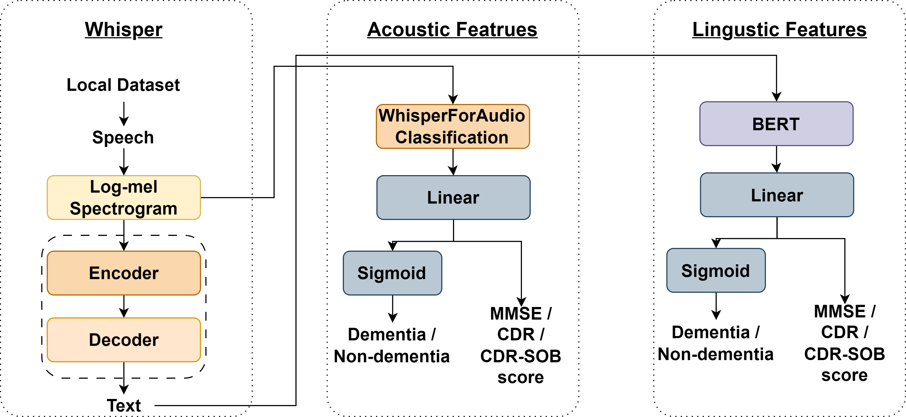
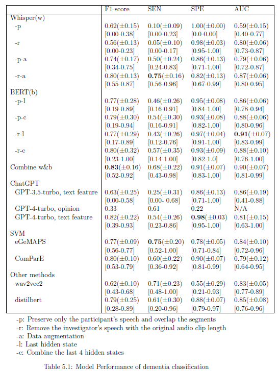
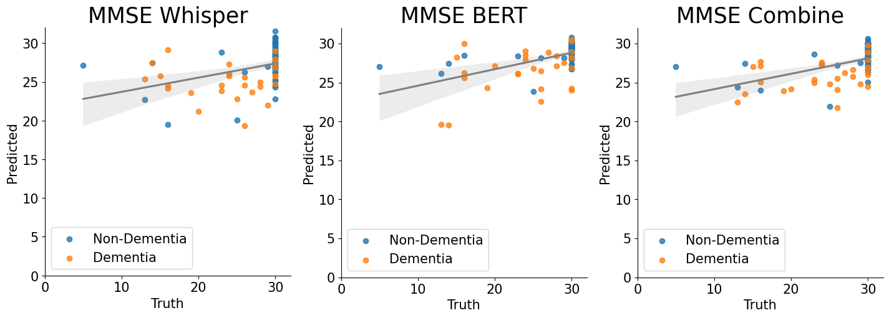
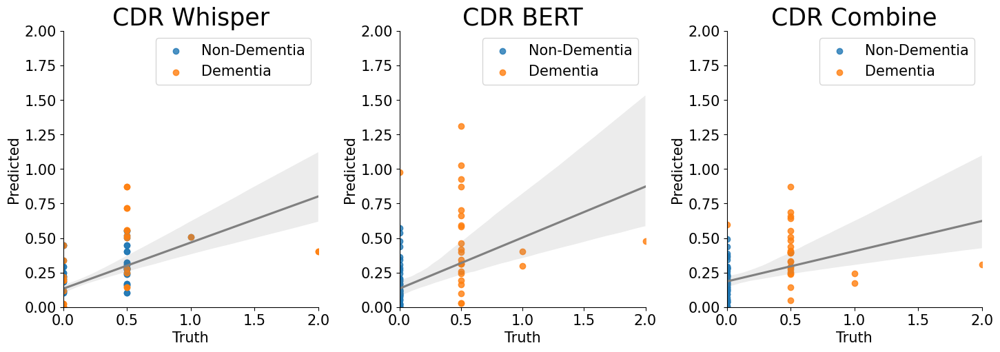
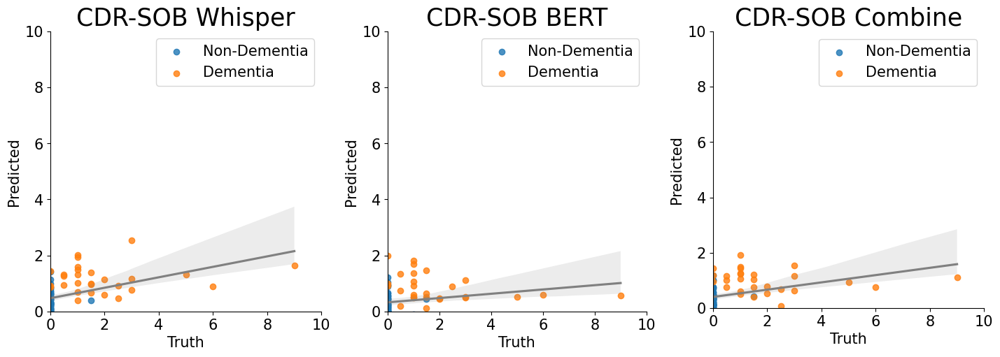
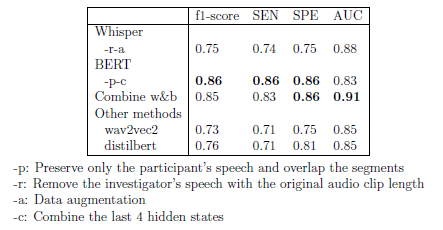
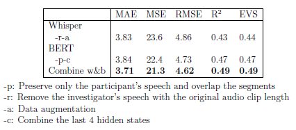

# Dementia Assesment on Mandarin Speech
Dementia Assessment on Mandarin Speech Using Transformer-based Acoustic and Linguistic Features

## Set up
Create conda environment with Python
```bash
conda create --name {conda_env_name} python=3.8
conda activate {conda_env_name}
```

Install Jupyter kernel
```bash
conda install jupyter ipykernel
python -m ipykernel install --name {ipykernel_name} --user
```

Install PyTorch and other packages
```bash
pip install torch==1.13.1+cu117 torchvision==0.14.1+cu117 torchaudio==0.13.1 --extra-index-url https://download.pytorch.org/whl/cu117s
pip install -r requirements.txt
```

## Approach

We used the Transformer-based models and divided them into:
1. Use Whisper to extract acoustic features from spontaneous speech.
2. Use BERT to extract linguistic features from text generated by Whisper.

## Performance

### Dementia Detection


### Score Prediction




### ADReSSo




